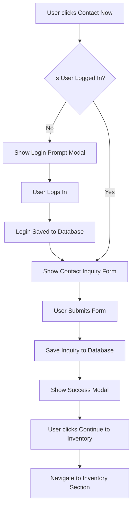

# Contact Now Feature Implementation Plan

## Overview
Replace the "Call Now" button in the car details page with a "Contact Now" button that triggers a login-protected contact inquiry flow.

## User Flow



## Database Schema

### New Table: `contact_inquiries`

```sql
create table if not exists public.contact_inquiries (
  id uuid default gen_random_uuid() primary key,
  car_id uuid references public.cars(id) on delete cascade,
  user_id uuid references auth.users(id) on delete cascade,
  name text not null,
  phone text not null,
  message text,
  status text default 'new' check (status in ('new', 'contacted', 'closed')),
  created_at timestamptz default now()
);

-- Enable RLS
alter table public.contact_inquiries enable row level security;

-- Policies
create policy "Users can read own inquiries"
  on public.contact_inquiries for select
  using (auth.uid() = user_id);

create policy "Admins can read all inquiries"
  on public.contact_inquiries for select
  using (
    exists (select 1 from public.profiles where id = auth.uid() and role = 'admin')
  );

create policy "Authenticated users can insert inquiries"
  on public.contact_inquiries for insert
  with check (auth.uid() = user_id);

-- Indexes for performance
create index idx_contact_inquiries_user on public.contact_inquiries(user_id);
create index idx_contact_inquiries_car on public.contact_inquiries(car_id);
create index idx_contact_inquiries_status on public.contact_inquiries(status);
create index idx_contact_inquiries_created on public.contact_inquiries(created_at desc);
```

### Update Profiles Table
Add `last_login_at` field to track user login timestamps:

```sql
alter table public.profiles add column if not exists last_login_at timestamptz;
```

## Components to Create

### 1. LoginPromptModal
- **Location**: `src/components/modals/LoginPromptModal.tsx`
- **Purpose**: Prompt unauthenticated users to log in
- **Features**:
  - Google OAuth button
  - Email/password login option
  - Link to signup page
  - Close button to dismiss

### 2. ContactInquiryForm
- **Location**: `src/components/modals/ContactInquiryForm.tsx`
- **Purpose**: Collect user inquiry details
- **Fields**:
  - Name (pre-filled from profile if available)
  - Phone Number (required)
  - Message (optional textarea)
- **Features**:
  - Form validation
  - Loading state during submission
  - Error handling

### 3. SuccessModal
- **Location**: `src/components/modals/SuccessModal.tsx`
- **Purpose**: Confirm successful submission
- **Features**:
  - Success message: "Your inquiry has been submitted successfully. Our team will contact you soon."
  - "Continue to Inventory" button

### 4. Admin Users Section
- **Location**: `src/app/admin/users/page.tsx`
- **Purpose**: Display all registered users
- **Features**:
  - Table with columns: Email, Name, Role, Last Login, Created At
  - Filter by role (user/admin)
  - Search functionality

### 5. Admin Inquiries Section
- **Location**: `src/app/admin/inquiries/page.tsx`
- **Purpose**: Display all contact inquiries
- **Features**:
  - Table with columns: Car, User, Name, Phone, Message, Status, Created At
  - Filter by status (new/contacted/closed)
  - Status update functionality
  - Link to view car details

## API Routes

### POST `/api/contact-inquiries`
- **Purpose**: Submit a new contact inquiry
- **Auth Required**: Yes
- **Request Body**: `{ car_id, name, phone, message }`
- **Response**: `{ success: true, inquiry_id }` or error

## File Changes Summary

### Files to Modify
1. `src/app/cars/[id]/page.tsx` - Replace Call Now with Contact Now, add modal logic
2. `src/context/AuthContext.tsx` - Add last_login_at update on login
3. `src/components/admin/AdminSidebar.tsx` - Add Users and Inquiries nav items
4. `supabase/schema.sql` - Add contact_inquiries table

### Files to Create
1. `src/components/modals/LoginPromptModal.tsx`
2. `src/components/modals/ContactInquiryForm.tsx`
3. `src/components/modals/SuccessModal.tsx`
4. `src/app/admin/users/page.tsx`
5. `src/app/admin/inquiries/page.tsx`
6. `src/app/api/contact-inquiries/route.ts`
7. `supabase/contact-inquiries.sql` - Migration script

## Admin Dashboard Updates

The admin page will have two new sections accessible from the sidebar:

### Users Section
Shows all registered users with:
- Email
- Full Name
- Role (user/admin)
- Last Login timestamp
- Account Created date

### Inquiries Section
Shows all contact inquiries with:
- Car details (make, model, year)
- User email
- Contact name
- Phone number
- Message
- Status (new/contacted/closed)
- Submitted date
- Actions (mark as contacted, close)

## Implementation Order

1. **Database Setup**
   - Create contact_inquiries table
   - Add last_login_at to profiles
   - Set up RLS policies

2. **Modal Components**
   - LoginPromptModal
   - ContactInquiryForm
   - SuccessModal

3. **Car Details Page Update**
   - Replace Call Now button
   - Implement contact flow logic
   - Integrate modals

4. **API Route**
   - Create contact inquiry submission endpoint

5. **Admin Sections**
   - Users page
   - Inquiries page
   - Update sidebar navigation

6. **Auth Context Update**
   - Track last_login_at on successful login

## Notes

- The existing authentication system using Supabase Auth is already in place
- Google OAuth and email/password login are both supported
- The profiles table already stores user information
- RLS policies ensure data security
